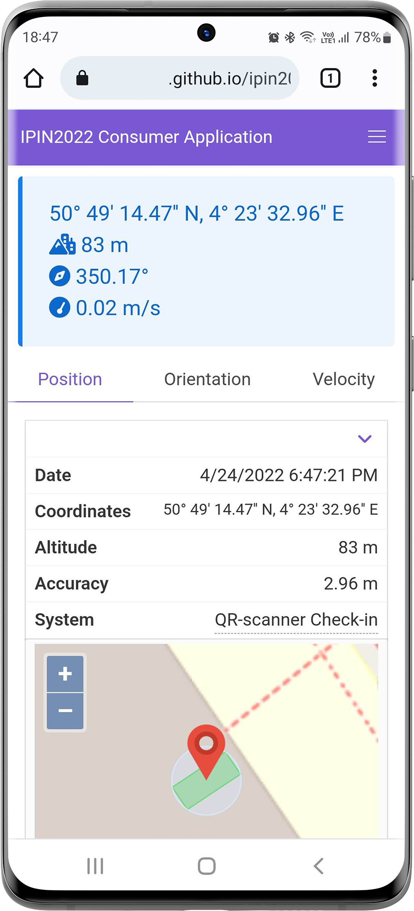

# A Solid-based Architecture for Decentralised Interoperable Location Data
## IPIN2022 Example Implementation

> :warning: **Blind review warning**: Note that for the blind review process we only exported the anonymised compiled sources
together with images and video material. The reason for this is to ensure the anonymisation. The complete documentation source code (as shown in the video and screenshots) will be available after the review is completed.
## About

## QR-scanner application
[https://openhps.github.io/ipin2022-solid/qrscanner/](https://openhps.github.io/ipin2022-solid/qrscanner/)

## Geolocation API application
[https://openhps.github.io/ipin2022-solid/geolocationapi/](https://openhps.github.io/ipin2022-solid/geolocationapi/)

## Consumer application
[https://openhps.github.io/ipin2022-solid/consumer/](https://openhps.github.io/ipin2022-solid/consumer/)

Example 1          |  Example 2
:-------------------------:|:-------------------------:
  |  

## Screenshots and Video
This section