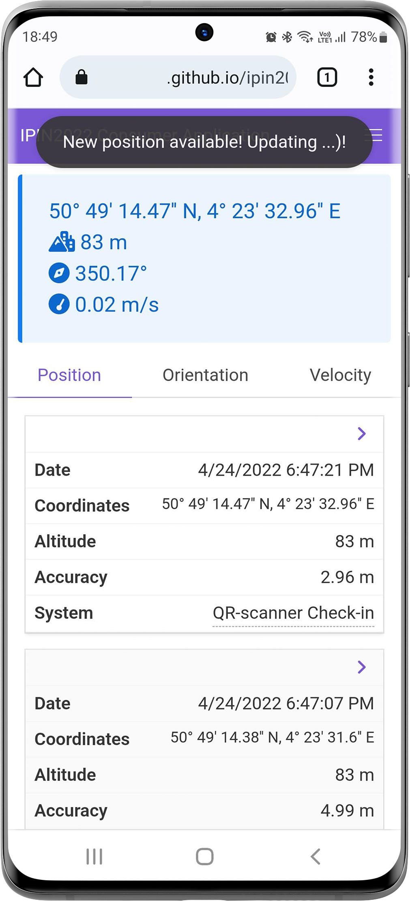

# A Solid-based Architecture for Decentralised Interoperable Location Data
## IPIN2022 Example Implementation
## About
In today's technological world of privacy-conscious users, the tracking of individuals via different positioning systems and services can be considered obtrusive. Furthermore, linking and integrating data from these positioning systems is not always possible or requires the major effort of creating new interfaces between systems. In this paper, we propose an architecture for the realisation of a decentralised positioning system based on the W3C's Solid platform specification. Using this specification, sensor data as well as an individual's location information is stored in secure decentralised data stores called Pods, that are hosted by user-selected Pod providers. We demonstrate that these Pods do not only offer transparent and interoperable data stores for persisting sensor data as well as processed location information, but also aid in linking multiple positioning systems for high- and low-level sensor fusion. For indoor positioning, this interoperability provides a way to offer users a single location-based service while also providing additional semantic context for other positioning systems to improve their data output. Developers of indoor positioning systems can store all data in a format that is readable, understandable and accessible by any other system that their users might be using, enabling collaboration between researchers and companies implementing these indoor positioning systems.
## QR-scanner application
[https://openhps.github.io/ipin2022-solid/qrscanner/](https://openhps.github.io/ipin2022-solid/qrscanner/)

## Geolocation API application
[https://openhps.github.io/ipin2022-solid/geolocationapi/](https://openhps.github.io/ipin2022-solid/geolocationapi/)

## Consumer application
[https://openhps.github.io/ipin2022-solid/consumer/](https://openhps.github.io/ipin2022-solid/consumer/)

Example 1          |  Example 2
:-------------------------:|:-------------------------:
  |  
